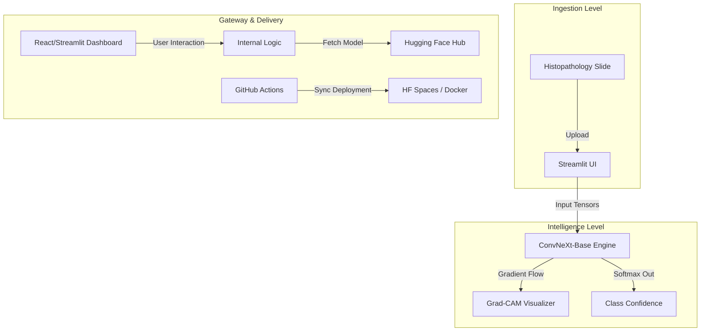

<div align="center">

  # LUCIAN — Lung Carcinoma Histopathology Imaging & Analysis
  **Autonomous Tissue Classification, Grad-CAM Explainability, and Intelligence-Driven Cancer Diagnostics.**
  
  
  
  
  
  
  
  
</div>

---

## Overview

Lung cancer remains a leading cause of cancer-related mortality globally. Early and precise classification of tissue types — Adenocarcinoma (LUAD), Squamous Cell Carcinoma (LUSC), and Benign tissue — is fundamental for effective treatment planning. 

**LUCIAN** is a specialized Computer Vision system that automates the analysis of histopathology slides. By leveraging SOTA deep learning architectures and explainability frameworks, this project bridges the gap between raw medical imaging and actionable diagnostic insights.

## Technical Features

- **Advanced Deep Learning**: Powered by a fine-tuned ConvNeXt-Base model, achieving high accuracy on standardized histopathology datasets.
- **Visual Explainability**: Integrated Gradient-weighted Class Activation Mapping (Grad-CAM) to visualize high-impact regions in tissue slides.
- **Systematic Methodology**: Developed following the CRISP-DM framework, ensuring a data-driven approach from business understanding to deployment.
- **Production-Ready CI/CD**: Automated testing (pytest) and deployment pipelines ensuring consistent application updates and reliability.
- **Flexible Deployment**: Multi-platform support including Docker, Streamlit Cloud, Hugging Face Spaces, and Azure.

## Technology Stack

### Core Intelligence
- Deep Learning: TensorFlow 2.19, Keras
- Processing: NumPy, Pandas
- Explainability: Grad-CAM (OpenCV + TF)

### Web Interface
- Framework: Streamlit 1.45 (Multi-page Architecture)
- Styling: Vanilla CSS integration
- Metrics Visualization: Plotly

### Infrastructure & DevOps
- Containerization: Docker
- Version Control & CI/CD: Git, GitHub Actions
- Model Registry: Hugging Face Hub

## Model Architecture

The core of LUCIAN is a transfer learning implementation using the **ConvNeXt-Base** backbone, pre-trained on ImageNet-1K. The model is optimized for 224 x 224 px histopathology inputs.

- **Base Model**: ConvNeXt-Base (feature extractor)
- **Classification Head**:
  - Global Average Pooling
  - Dense Layer (256 units, ReLU activation)
  - Dropout (30% rate for regularization)
  - Output Layer (3 units, Softmax activation)
- **Dataset**: LC25000 Lung Histopathology Dataset (3,000 images across 3 classes)

## System Architecture



---

## Performance & Metrics

LUCIAN was evaluated using multiple data split strategies to ensure robustness and generalization.

### Core Metrics (80:10:10 Split)
| Parameter | Value | Description |
| :--- | :--- | :--- |
| **Test Accuracy** | **93.67%** | Final performance on unseen test data |
| **F1-Score (Macro)** | **93.64%** | Balanced precision and recall indicator |
| **Precision (Macro)** | **93.63%** | Accuracy of positive predictions |
| **Recall (Macro)** | **93.67%** | Ability to identify all relevant instances |

### Per-Class Performance
| Class | Precision | Recall | F1-Score |
| :--- | :--- | :--- | :--- |
| Adenocarcinoma | 91.75% | 89.00% | 90.36% |
| Benign Tissue | 98.04% | 100.00% | 99.01% |
| Squamous Carcinoma | 91.09% | 92.00% | 91.54% |

---

## Deployment Guide

### Prerequisites
- Python 3.12+
- Docker (optional for containerized runs)

### Execution Options

**Option 1: Local Development Mode**
```bash
# Initialize environment
python -m venv venv
source venv/bin/activate  # venv\Scripts\activate on Windows
pip install -r requirements.txt

# Run Application
streamlit run app.py
```

**Option 2: Docker Deployment**
```bash
# Build Container
docker build -t lucian .

# Run Container
docker run -p 7860:7860 lucian
```

## Configuration

The application centralizes its constants and model settings within `src/config.py`. Key configurable parameters include:
- `HF_REPO_ID`: The Hugging Face Hub repository containing the model weights.
- `IMAGE_SIZE`: Default tensor dimensions (Current: `224x224`).
- `GRADCAM_LAYER`: Target layer for explainability heatmaps (Current: `flatten`).

---

## Author

**Felix Hardyan**
- HuggingFace: [felixhrdyn](https://huggingface.co/felixhrdyn)

---

*Undergraduate Thesis Project — Computer Science, 2025*